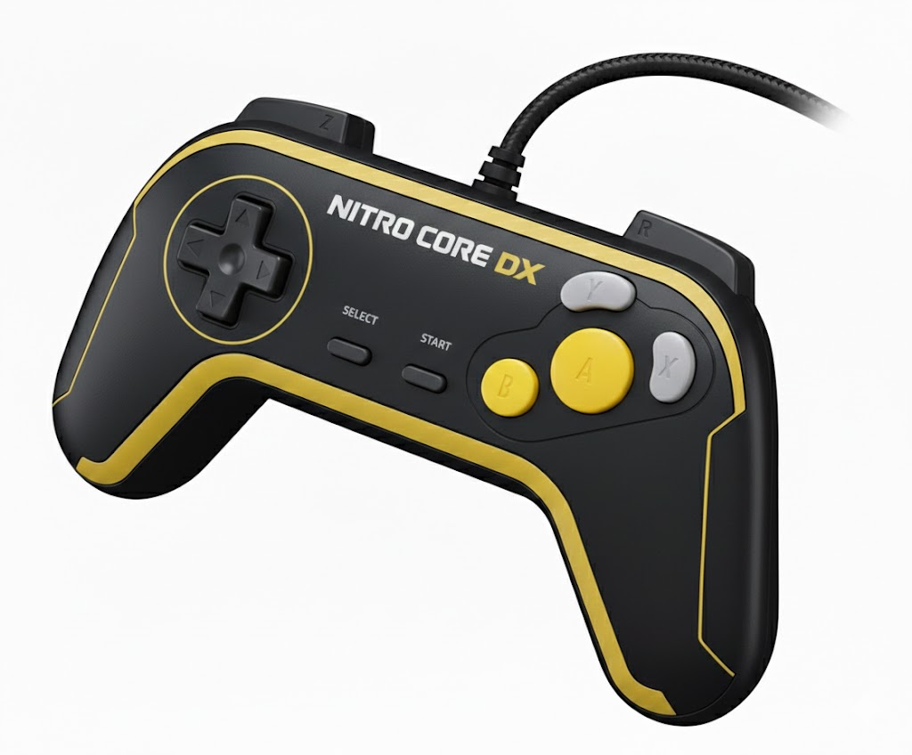

# Nitro-Core-DX

**A Fantasy Console Emulator Combining SNES Graphics with Genesis Power**

A custom 16-bit fantasy console emulator inspired by classic 8/16-bit consoles, designed to combine the best features of the SNES and Sega Genesis into a single, powerful platform.

> **✅ Architecture Stable**: The core hardware architecture is complete and stable. All hardware features are implemented and tested. The system is ready for game development. Optional enhancements may be added in the future, but they won't break compatibility with existing ROMs.

---

## Meet Nitro-Core-DX

Ever wonder what would happen if you took the SNES's gorgeous graphics and mixed them with the Genesis's raw horsepower? That's exactly what Nitro-Core-DX is all about. It's a fantasy console that doesn't just emulate the classics—it creates something entirely new by combining the best of both worlds.

---

## The Three-Layer Challenge: Hardware, Emulator, and Compiler

Nitro-Core-DX isn't just an emulator—it's a complete system built from scratch. This project involves three major components, each with its own complexity:

### 1. **Hardware Architecture Design**
The foundation: designing a custom 16-bit CPU, memory map, PPU (graphics), APU (audio), and I/O systems. This includes:
- Custom instruction set with 16-bit operations
- Banked memory architecture (256 banks × 64KB = 16MB addressable)
- Graphics pipeline with 4 background layers, sprites, Matrix Mode
- Audio synthesis with 4 channels and waveform generation
- Memory-mapped I/O registers for hardware control

**The Challenge**: Every design decision affects everything else. Change a register layout? Update the emulator. Modify the instruction encoding? Fix the compiler. It's a delicate balance between "what's possible" and "what's practical."

### 2. **Emulator Implementation**
The execution layer: cycle-accurate CPU emulation, pixel-perfect PPU rendering, sample-accurate audio synthesis. This includes:
- CPU instruction execution with precise cycle counting
- PPU rendering pipeline (tiles, sprites, layers, Matrix Mode)
- APU waveform generation and mixing
- Memory bus routing and bank switching
- Synchronization (VBlank, frame counter, completion flags)

**The Challenge**: The emulator must match the hardware specification exactly. A single cycle off can cause timing issues. A register read/write bug can break entire games. And when something doesn't work, is it the emulator's fault or the hardware design?

### 3. **CoreLX Compiler**
The language layer: a custom compiled language (CoreLX) with Lua-like syntax, designed for hardware-first programming. This includes:
- Lexer and parser for CoreLX syntax
- Semantic analysis and type checking
- Code generation (translating CoreLX to Nitro-Core-DX assembly)
- Built-in function mapping (PPU, APU, sprite operations)
- Asset embedding and ROM building

**The Challenge**: The compiler must generate correct assembly code that matches the hardware's expectations. A wrong register allocation? The ROM crashes. An incorrect memory address? Graphics glitch. And when the ROM doesn't work, is it the compiler's fault, the emulator's fault, or the hardware design?

---

## The Debugging Nightmare: Where's the Bug?

This is where things get interesting—and frustrating. When something doesn't work, there are **four potential sources of the problem**:

### 🔍 **Is it the ROM code?**
- Did I write the CoreLX code correctly?
- Is the logic sound?
- Are the function calls correct?

### 🔍 **Is it the compiler?**
- Did the compiler generate the wrong assembly?
- Is register allocation incorrect?
- Are memory addresses calculated wrong?
- Did built-in functions get translated incorrectly?

### 🔍 **Is it the emulator?**
- Is the CPU executing instructions correctly?
- Are memory reads/writes working?
- Is the PPU rendering correctly?
- Are I/O registers responding as expected?
- Is synchronization working?

### 🔍 **Is it the hardware design?**
- Is the instruction set complete?
- Are the register layouts correct?
- Is the memory map sound?
- Are there design flaws that need fixing?

**The Reality**: Most bugs involve multiple layers. A compiler bug might generate code that exposes an emulator bug, which reveals a hardware design flaw. Or vice versa. It's like debugging a house of cards—fix one thing, and three others might fall over.

---

## Flying Blind: The Learning Experience

I'm building this project "flying blind"—learning as I go, with AI assistance helping where I'm technically weak. It's an incredible learning experience, but it comes with unique challenges:

### The Good
- **Deep Understanding**: Building everything from scratch means understanding every layer
- **Creative Freedom**: No legacy constraints—design what makes sense
- **AI Assistance**: AI helps with heavy lifting (code generation, documentation, debugging suggestions)
- **Real Learning**: Every bug teaches something new about hardware, compilers, or emulation

### The Hard Parts
- **Isolation is Difficult**: When a ROM crashes, which layer is at fault?
- **Testing is Complex**: Need to test hardware design, emulator accuracy, and compiler correctness
- **Documentation is Critical**: Without good docs, it's impossible to know what "correct" behavior is
- **No Reference Implementation**: Can't compare to "known good" behavior—we're defining what "good" is

### The Strategy
1. **Test Each Layer Independently**: Write assembly ROMs to test emulator. Write simple CoreLX to test compiler.
2. **Comprehensive Logging**: Log everything—CPU cycles, memory access, register changes, PPU state
3. **Incremental Development**: Build one feature at a time, test thoroughly before moving on
4. **Document Everything**: Write down expected behavior, test cases, known issues
5. **Use AI Strategically**: AI helps with code generation and debugging, but I make the architectural decisions

---

## Project Components Overview

### Core Emulator (`cmd/emulator/`)
The main emulator application that runs ROMs. Handles:
- ROM loading and execution
- CPU cycle execution
- PPU frame rendering
- APU audio synthesis
- Input handling
- UI (SDL2-based)

### CoreLX Compiler (`cmd/corelx/` + `internal/corelx/`)
The CoreLX language compiler. Handles:
- Lexing and parsing CoreLX source files
- Semantic analysis and type checking
- Code generation (CoreLX → Nitro Core DX assembly)
- ROM building (assembly → ROM binary)

**Status**: Phase 1 complete (all built-in functions implemented). Phase 2 (asset system) and Phase 3 (struct system) in progress.

### Hardware Design (Documented in `SYSTEM_MANUAL.md`)
The hardware specification. Defines:
- CPU instruction set and encoding
- Memory map and bank switching
- PPU registers and rendering pipeline
- APU registers and audio synthesis
- I/O register layout

**Status**: Architecture stable. All core features implemented and tested.

### Development Tools
Various utilities for testing and development:
- `cmd/testrom/` - Test ROM generator
- `cmd/demorom/` - Demo ROM generator
- `cmd/audiotest/` - Audio test ROM generator
- `cmd/debugger/` - Debugging tools
- `cmd/trace_*/` - Tracing utilities

---

Here's what the console will look like when I build the first prototype:

<div align="center">


*Isometric view of the Nitro-Core-DX console*


*Top-down view showing the console design*



*The Nitro-Core-DX controller design*

</div>

Think of it as the console that could have existed in an alternate timeline where Nintendo and Sega decided to collaborate instead of compete. I'm building this from the ground up with modern tools, but with the soul of the 16-bit era.

---

## Project Status

### ✅ Currently Implemented

- **Core Emulation**: CPU, Memory, PPU, APU, Input systems (100% complete)
- **Synchronization**: One-shot completion status, frame counter, VBlank flag
- **Graphics System**: Complete PPU with all features
  - Sprite system with priority, blending, and alpha transparency
  - 4 background layers with per-layer Matrix Mode transformations
  - Matrix Mode with outside-screen handling and direct color mode
  - Mosaic effect, DMA transfers, sprite-to-background priority
- **Audio System**: 4-channel audio synthesis with PCM playback support
  - Waveform generation (sine, square, saw, noise)
  - PCM sample playback with loop and one-shot modes
  - Volume control and duration management
- **Interrupt System**: Complete IRQ/NMI handling with vector table
- **ROM Loading**: Complete ROM header parsing and execution
- **Debugging Tools**: Register viewer, memory viewer, cycle-by-cycle logger
- **Test Suite**: Comprehensive tests for all hardware features

### 🚧 In Progress

- **Development Tools**: Advanced debugging features, tile viewer panel
- **Language Design**: NitroLang compiler design (documentation phase)

### ❌ Optional Enhancements (Not Required)

- **Vertical Sprites**: 3D sprite scaling for Matrix Mode (can be added later)
- **FM Synthesis**: Advanced audio synthesis (can be added later)

For detailed status, see the [System Manual](SYSTEM_MANUAL.md).

---

## Documentation

The project documentation is organized into four main documents:

- **[README.md](README.md)**: Project overview, quick start, build instructions, and contributing guide
- **[HARDWARE_SPECIFICATION.md](HARDWARE_SPECIFICATION.md)**: Complete hardware specification for FPGA implementation
- **[SYSTEM_MANUAL.md](SYSTEM_MANUAL.md)**: Complete system architecture, FPGA compatibility, testing framework, and development tools
- **[docs/CORELX.md](docs/CORELX.md)**: Complete CoreLX language documentation
- **[PROGRAMMING_MANUAL.md](PROGRAMMING_MANUAL.md)**: Complete programming guide covering both CoreLX and assembly languages
- **[CHANGELOG.md](CHANGELOG.md)**: Version history and change log
- **[END_OF_DAY_PROCEDURE.md](END_OF_DAY_PROCEDURE.md)**: End-of-day cleanup and documentation procedure

---

## The Vision: Best of Both Worlds

Nitro-Core-DX started with a simple question: *"What if?"* What if you could take the SNES's beautiful graphics and combine them with the Genesis's raw speed? What if you didn't have to choose between Mode 7 effects and smooth 60 FPS gameplay? (Target: 60 FPS, currently ~30 FPS)

This isn't just another emulator—it's a passion project that's building something genuinely new. I'm not trying to recreate history; I'm trying to create the console that *should have* existed. And I'm doing it the right way: cycle-accurate emulation, proper architecture, comprehensive testing, and documentation that actually makes sense.

### What I'm Stealing (Politely) from SNES

The SNES brought some incredible graphics tech, and Nitro-Core-DX brings all of it:

- **4 Background Layers** - Parallax scrolling that'll make your eyes happy
- **Matrix Mode** - Mode 7-style perspective and rotation (but better, because it can do it on multiple layers simultaneously)
- **32,768 Colors** - That gorgeous 15-bit RGB555 palette
- **Sprite Magic** - Priorities, blending modes, alpha transparency—the works
- **Smart Memory** - Banked architecture that gives you flexibility without headaches

### What I'm Borrowing from Genesis

The Genesis was fast, and I like fast:

- **~7.67 MHz CPU** - Nearly 3× faster than the SNES's 2.68 MHz (yes, the math checks out)
- **DMA That Actually Works** - Fast memory transfers that don't slow you down
- **Arcade Performance** - The kind of speed that makes racing games and shooters feel *right*

### The Result?

A fantasy console that gives you SNES-quality visuals running at Genesis-level performance. Target is smooth 60 FPS (currently ~30 FPS) with complex graphics, advanced parallax scrolling, and Matrix Mode effects that can handle 3D landscapes and racing games.

**My Philosophy:**
I'm not in a rush. This is a long-term project where doing it right matters more than doing it fast. Every component gets the attention it deserves—from cycle-accurate CPU emulation to hardware-accurate synchronization signals. I'm building something that'll last.

---

## Why Go? 

I didn't just pick Go because it's trendy. I evaluated multiple languages and Go won because it hits the sweet spot between "fast enough" and "actually maintainable."

Here's why Go works so well for Nitro-Core-DX:

- **Performance**: Target is 60 FPS (currently achieving ~30 FPS, optimization ongoing)
- **Developer Experience**: Clean syntax that doesn't make you want to throw your keyboard
- **Concurrency**: Built-in goroutines that make audio/rendering threading actually pleasant
- **Cross-Platform**: One binary, runs everywhere (Linux, macOS, Windows—you name it)
- **Memory Safety**: Garbage collected, but not in a "pause the world for 5 seconds" kind of way
- **Maintainability**: Code that you can actually read and understand six months later

The best part? When I eventually port this to FPGA hardware, the architecture I've built in Go will translate cleanly. That's not an accident—it's by design.

---

## Features

### Core Emulation (The Good Stuff)

- **100% Cycle-Accurate CPU Emulation**
  - Custom 16-bit CPU that's actually fun to program for
  - Banked 24-bit addressing (because 64KB just isn't enough anymore)
  - 8 general-purpose registers (R0-R7) that do what you tell them
  - Complete instruction set—arithmetic, logical, branching, jumps, the whole package
  - Precise cycle counting because timing matters

- **Pixel-Perfect PPU Rendering**
  - 4 independent background layers (BG0-BG3) that you can actually use simultaneously
  - 128 sprites with priorities and blending modes (make them transparent, make them glow, make them do whatever you want)
  - Matrix Mode that's like Mode 7, but you can use it on multiple layers at once (take that, SNES!)
  - Windowing system with proper logic (OR/AND/XOR/XNOR—because sometimes you need that)
  - HDMA for per-scanline effects that'll make your parallax scrolling look amazing
  - Vertical sprites for those pseudo-3D worlds you've been dreaming about

- **Sample-Accurate APU**
  - 4 audio channels with real waveforms (sine, square, saw, noise)
  - 44,100 Hz sample rate (CD quality, because your ears deserve it)
  - PCM playback support (play actual samples, not just generated tones)
  - Master volume control (turn it up, turn it down, it's your call)
  - Low-latency audio that doesn't make you want to mute your speakers

- **Precise Memory Mapping**
  - Banked memory architecture (256 banks × 64KB = 16MB of addressable space)
  - WRAM (32KB), Extended WRAM (128KB), ROM (up to 7.8MB)
  - I/O register routing that actually makes sense

- **ROM Loading and Execution**
  - Proper header parsing (32-byte header, because proper standards matter)
  - Entry point handling that works the way you expect
  - LoROM-style memory mapping that'll feel familiar

### Performance (Because Speed Matters)

**Performance Status**: The emulator targets a steady 60 FPS, but currently achieves approximately 30 FPS. Performance optimization is an ongoing effort.

Here's how the emulator is designed to achieve 60 FPS:

- **Frame Limiting**: Automatic 60 FPS that actually works
  - High-resolution timers (nanosecond precision, because accuracy matters)
  - Smooth frame pacing (exactly 16.666... milliseconds per frame, no more, no less)
  - No stuttering, no frame drops, no frame skips—just smooth gameplay

- **Unlimited Mode**: For when you need to go fast
  - Remove all frame limiting for testing and speedruns
  - Toggle it in the settings menu when you want to see how fast things *could* run

- **Performance Optimization**:
  - Optimized hot paths (CPU instruction execution, PPU rendering)
  - Efficient algorithms for tile rendering, sprite sorting, Matrix Mode
  - Zero-cost logging when disabled (because debug builds shouldn't be slow)

### Development Toolkit (For When Things Go Wrong)

The emulator includes a comprehensive debugging environment because let's face it—you're going to need it. I've built the tools I wish existed when I was debugging my own ROMs.

#### Logging System

- **Component Logging**:
  - CPU Logger: Every instruction execution, register changes, flag updates
  - Memory Logger: All memory reads/writes, bank switches, I/O access
  - PPU Logger: VRAM/CGRAM/OAM writes, layer rendering, Matrix Mode calculations
  - APU Logger: Channel updates, waveform generation, frequency changes
  - Input Logger: Controller state changes, button presses

- **Log Features**:
  - Filterable by component, address range, instruction type
  - Searchable with full-text search
  - Exportable to file (text, CSV, JSON)
  - Cycle-accurate or frame-accurate timestamps
  - Color-coded by component
  - Scrollable with auto-scroll toggle
  - Log levels: None, Errors, Info, Debug, Trace

#### CPU Debugging Tools

- **Register Viewer**: Real-time display of all registers (R0-R7, PC, SP, PBR, DBR, Flags)
- **Instruction Tracer**: Current instruction, disassembly, address, cycles
- **Breakpoints**: Address breakpoints, instruction type breakpoints, conditional breakpoints
- **Watchpoints**: Monitor memory addresses and register values
- **Call Stack**: Function call stack with return addresses

#### PPU Debugging Tools

- **Layer Viewer**: Toggle individual background layers, show scroll positions
- **Sprite Viewer**: List all 128 sprites with attributes, highlight active sprites
- **Tile Viewer**: Browse VRAM tiles visually, export tiles as images
- **Palette Viewer**: Visual palette editor (CGRAM), edit colors in real-time
- **Tilemap Viewer**: Visual tilemap editor, navigate through multiple tilemaps
- **Matrix Mode Visualizer**: Visualize transformation matrix effects

#### APU Debugging Tools

- **Channel Viewer**: Show all 4 channels with current state
- **Waveform Display**: Real-time waveform visualization (oscilloscope-style)

#### Memory Tools

- **Memory Viewer (Hex Editor)**: View and edit all memory regions
  - WRAM, Extended WRAM, VRAM, CGRAM, OAM, ROM
  - Search functionality (find bytes, patterns, strings)
  - Bookmark frequently accessed addresses
  - Memory dump/export capabilities
  - Real-time memory monitoring

- **Live Memory Map**: Visual representation of entire memory space
  - Color-coded regions
  - Memory usage heat map
  - Click to jump to memory viewer

- **Memory Dump**: Export memory regions to file (Binary, Hex, C array, JSON)

### User Interface: Actually Usable

- **Main Window**:
  - Emulator screen (320×200, scaled to whatever size your monitor can handle)
  - Menu bar with all the things you'd expect (File, Emulation, View, Debug, Settings, Help)
  - Toolbar with quick actions (Play, Pause, Reset, Step—because clicking is faster than typing)
  - Status bar that shows you what's actually happening (FPS counter, cycle count, frame time)

- **Dockable Panels**:
  - CPU Registers panel (watch those registers change in real-time)
  - Memory Viewer panel (hex editor that doesn't make you want to cry)
  - Logs panel (see what's happening, when it's happening)
  - Debugger panel (breakpoints, watchpoints, the whole debugging experience)
  - All panels dockable, resizable, and hideable (because your screen space is precious)

- **Settings Menu**:
  - Emulation Settings: Frame limit (60 FPS / Unlimited), audio settings, input settings
  - Display Settings: Video scaling (1×-6×), fullscreen mode, VSync toggle
  - Debug Settings: Log levels per component, performance profiling

### Video Scaling: Multiple Resolution Support

The console has a native resolution of 320×200 pixels. To make it usable on modern displays:

- **Scaling Options**: 1×, 2×, 3×, 4×, 5×, 6× (native resolution multipliers)
- **Scaling Quality**: High-quality scaling algorithms (bilinear, bicubic, or nearest-neighbor for pixel-perfect)
- **Aspect Ratio**: Maintain aspect ratio
- **Integer Scaling**: Option for pixel-perfect scaling (no blur)

**Future: CRT Shaders**
- Plan for CRT-style shader support (scanlines, phosphor glow, curvature, chromatic aberration)
- Shader selection in settings menu (when implemented)

---

## Quick Start (Let's Get This Running)

### Prerequisites

You'll need a few things before you can get started:

- **Go 1.18 or later** ([Download Go](https://golang.org/dl/)) - The language I'm using, because it's actually good
- **SDL2 Development Libraries** (for the UI that you'll actually see)
  - **Ubuntu/Debian**: `sudo apt-get install libsdl2-dev`
  - **Fedora/RHEL**: `sudo dnf install SDL2-devel`
  - **macOS**: `brew install sdl2`
  - **Windows**: Download from [SDL2 website](https://www.libsdl.org/download-2.0.php)

**Optional - SDL2_ttf** (for system fonts instead of our bitmap fonts):
  - **Ubuntu/Debian**: `sudo apt-get install libsdl2-ttf-dev`
  - **macOS**: `brew install sdl2_ttf`
  - **Windows**: Download from [SDL2_ttf website](https://www.libsdl.org/projects/SDL_ttf/)
  
  *Note: The emulator works fine without SDL2_ttf—it has a built-in bitmap font that looks pretty good.*

### Installation

1. **Clone the repository:**
   ```bash
   git clone https://github.com/RetroCodeRamen/Nitro-Core-DX.git
   cd Nitro-Core-DX
   ```

2. **Build the emulator:**
   
   **Without SDL2_ttf (recommended if SDL2_ttf is not installed):**
   ```bash
   go build -tags "no_sdl_ttf" -o nitro-core-dx ./cmd/emulator
   ```
   
   **With SDL2_ttf (if you have SDL2_ttf installed):**
   ```bash
   go build -o nitro-core-dx ./cmd/emulator
   ```
   
   **Note:** The emulator binary is named `nitro-core-dx` (not `emulator`). This is the FPGA-ready, clock-driven emulator.

3. **Build a test ROM (optional):**
   ```bash
   go build -o testrom ./cmd/testrom
   ./testrom test.rom
   ```

4. **Run the emulator:**
   ```bash
   ./nitro-core-dx -rom test.rom
   ```

### Command Line Options

- `-rom <path>`: Path to ROM file (required)
- `-unlimited`: Run at unlimited speed (no frame limit)
- `-scale <1-6>`: Display scale multiplier (default: 3)
- `-log`: Enable logging (disabled by default)

### Example Usage

```bash
# Run with default 3x scale
./nitro-core-dx -rom test.rom

# Run at unlimited speed with 4x scale
./nitro-core-dx -rom test.rom -unlimited -scale 4

# Run with 1x scale (native resolution)
./nitro-core-dx -rom test.rom -scale 1

# Run with logging enabled
./nitro-core-dx -rom test.rom -log
```

### Controls (The Important Part)

- **Arrow Keys / WASD**: Move stuff around
- **Z / W**: A button (do things)
- **X**: B button (do other things)
- **Space**: Pause/Resume (because sometimes you need a break)
- **Ctrl+R**: Reset emulator (when things go sideways)
- **Alt+F**: Toggle fullscreen (for that immersive experience)
- **ESC**: Quit (when you're done)

### Building from Source

```bash
# Build the emulator
go build -tags "no_sdl_ttf" -o nitro-core-dx ./cmd/emulator

# Build test ROM generators
go build -o testrom ./cmd/testrom
go build -o demorom ./cmd/demorom
go build -o audiotest ./cmd/audiotest

# Run tests
go test ./...

# Format code
go fmt ./...
```

### Troubleshooting (When Things Don't Work)

**SDL2 Not Found:**
1. Install SDL2 development libraries (see Prerequisites above)
2. Make sure `pkg-config` can find SDL2: `pkg-config --modversion sdl2`
3. If using a custom SDL2 installation, set `PKG_CONFIG_PATH` environment variable

**Build Errors:**
- Make sure Go is properly installed: `go version` (should show 1.18 or later)
- Make sure all dependencies are downloaded: `go mod download`
- Clean and rebuild: `go clean -cache && go build ./...` (sometimes Go's cache gets confused)

**Runtime Errors:**
- Check that the ROM file exists and is readable (file permissions matter!)
- Verify the ROM file is a valid Nitro-Core-DX ROM (magic number "RMCF")
- Check console output for specific error messages (I try to make them helpful)

---

## System Specifications

| Feature | Specification |
|---------|--------------|
| **Display Resolution** | 320×200 pixels (landscape) / 200×320 (portrait) |
| **Color Depth** | 256 colors (8-bit indexed) |
| **Color Palette** | 256-color CGRAM (RGB555 format, 32,768 possible colors) |
| **Tile Size** | 8×8 or 16×16 pixels (configurable per layer) |
| **Max Sprites** | 128 sprites |
| **Background Layers** | 4 independent layers (BG0, BG1, BG2, BG3) |
| **Matrix Mode** | Mode 7-style effects with large world support, vertical sprites |
| **Audio Channels** | 4 channels (sine, square, saw, noise waveforms) |
| **Audio Sample Rate** | 44,100 Hz |
| **CPU Speed** | ~7.67 MHz (127,820 cycles per frame at 60 FPS, Genesis-like) |
| **Memory** | 64KB per bank, 256 banks (16MB total address space) |
| **ROM Size** | Up to 7.8MB (125 banks × 64KB) |
| **Frame Rate** | Target: 60 FPS (Currently: ~30 FPS) |

### Performance Targets

- **Target: 60 FPS** - Goal is steady frame rate with no drops
- **Current: ~30 FPS** - Currently achieving approximately 30 FPS, optimization work in progress
- **Frame Time Target**: < 16.67ms per frame (including rendering)
- **CPU Usage**: Reasonable CPU usage (not 100% on one core)
- **Memory Usage**: Efficient memory usage

---

## Recent Changes (January 6, 2026)

### Synchronization System

Implemented three complementary synchronization mechanisms:

1. **One-Shot Completion Status (0x9021)**: Audio channel completion detection
2. **Frame Counter (0x803F/0x8040)**: Precise frame-based timing
3. **VBlank Flag (0x803E)**: Hardware-accurate frame synchronization (FPGA-ready)

All three mechanisms work together to provide flexible, hardware-accurate timing. See [System Manual](SYSTEM_MANUAL.md) for details.

### Architecture Improvements

- ✅ Synchronized execution order (APU → CPU → PPU → Audio)
- ✅ One-shot flags prevent race conditions
- ✅ Hardware-accurate signals for FPGA compatibility
- ✅ Clear timing guarantees

---

## Development Philosophy: Building Something Real

This project is a **massive undertaking**—even with AI assistance doing heavy lifting in areas where I'm technically weak. Creating custom hardware, software, and a compiler for a new language is not trivial. Every component depends on every other component, and bugs can hide in any layer.

### Why This Matters

Most emulator projects start with existing hardware—you emulate what already exists, and you can compare your results to real hardware. But Nitro-Core-DX is different:

- **No Reference Hardware**: We're defining what the hardware *should* do, not emulating what it *does* do
- **No Existing Software**: We're creating the first software for this platform
- **No Existing Compiler**: We're building the first compiler for CoreLX
- **No Test Suite**: We're creating the test suite as we go

This means **every bug is a learning opportunity**, but it also means **debugging is incredibly difficult**. When a ROM crashes, is it:
- A bug in my ROM code?
- A bug in the compiler?
- A bug in the emulator?
- A design flaw in the hardware specification?

Often, it's a combination of all four.

### The Testing Challenge

The hardest part of this project isn't writing code—it's **isolating where problems come from**. Here's the typical debugging flow:

1. **Write a CoreLX program** → Compile it → Run it in emulator → It crashes
2. **Check the ROM**: Is the CoreLX code correct? (Maybe)
3. **Check the compiler output**: Did it generate correct assembly? (Maybe)
4. **Check the emulator**: Is it executing correctly? (Maybe)
5. **Check the hardware design**: Is the specification correct? (Maybe)

The answer is usually "a little bit of everything." A compiler bug might generate code that exposes an emulator bug, which reveals a hardware design issue. Fix one thing, and three others might break.

### The Learning Journey

I'm building this "flying blind"—learning as I go, with AI helping where I'm weak. It's an incredible learning experience:

- **Hardware Design**: Learning CPU architecture, memory systems, graphics pipelines
- **Emulator Development**: Learning cycle-accurate emulation, synchronization, timing
- **Compiler Design**: Learning lexing, parsing, code generation, optimization
- **System Integration**: Learning how all the pieces fit together

But it's also frustrating. When you're stuck, you can't just "look it up"—you're creating the reference. You can't "compare to real hardware"—you're defining what real hardware should be.

### The Strategy

1. **Test Each Layer Independently**
   - Write assembly ROMs to test emulator (bypass compiler)
   - Write simple CoreLX to test compiler (isolate compiler bugs)
   - Test hardware design with known-good code

2. **Comprehensive Logging**
   - Log CPU cycles, register changes, memory access
   - Log compiler intermediate representations
   - Log emulator state at every step

3. **Incremental Development**
   - Build one feature at a time
   - Test thoroughly before moving on
   - Don't move forward until current layer works

4. **Document Everything**
   - Write down expected behavior
   - Document test cases
   - Keep track of known issues
   - Update manuals when things change

5. **Use AI Strategically**
   - AI helps with code generation and debugging suggestions
   - But I make the architectural decisions
   - AI is a tool, not a replacement for understanding

### The Result

This project is a **real learning experience**. Every bug teaches something new. Every feature reveals new challenges. And every success feels like a genuine achievement—because it is. We're not just emulating something that exists; we're creating something new.

---

## Development

### Project Structure

```
nitro-core-dx/
├── cmd/
│   ├── emulator/          # Main emulator application
│   ├── corelx/            # CoreLX compiler (compiles .corelx → .rom)
│   ├── demorom/           # Demo ROM generator
│   ├── audiotest/         # Audio test ROM generator
│   ├── testrom/           # Test ROM generator
│   ├── debugger/          # Debugging tools
│   └── trace_*/           # Tracing utilities
├── internal/
│   ├── cpu/               # CPU emulation (cycle-accurate)
│   ├── memory/            # Memory system (banked architecture)
│   ├── ppu/               # Graphics system (4 layers, sprites, Matrix Mode)
│   ├── apu/               # Audio system (4-channel synthesis)
│   ├── input/             # Input system (12-button controllers)
│   ├── rom/               # ROM loading and building
│   ├── ui/                # User interface (SDL2)
│   ├── emulator/          # Emulator orchestration
│   ├── corelx/            # CoreLX compiler (lexer, parser, codegen)
│   └── debug/             # Debugging tools (logging, breakpoints)
├── test/
│   └── roms/              # Test ROMs (CoreLX and assembly)
├── docs/                  # Documentation
├── go.mod                 # Go module definition
├── go.sum                 # Go module checksums
├── README.md              # This file (project overview)
├── SYSTEM_MANUAL.md       # Hardware architecture and design
├── PROGRAMMING_MANUAL.md  # Programming guide (CoreLX + Assembly)
└── docs/
    ├── CORELX.md          # CoreLX language documentation
    └── archive/corelx/    # Historical CoreLX implementation notes
```

### Component Responsibilities

**Emulator (`internal/emulator/`, `internal/cpu/`, `internal/ppu/`, etc.)**
- Executes ROMs cycle-accurately
- Renders graphics pixel-perfectly
- Generates audio sample-accurately
- Handles I/O and synchronization

**Compiler (`internal/corelx/`, `cmd/corelx/`)**
- Parses CoreLX source code
- Generates Nitro Core DX assembly
- Builds ROM binaries
- Maps built-in functions to hardware operations

**Hardware Design (`SYSTEM_MANUAL.md`)**
- Defines CPU instruction set
- Specifies memory map
- Documents PPU/APU registers
- Establishes I/O protocols

**Testing (`test/roms/`, `internal/*/*_test.go`)**
- Test ROMs (CoreLX and assembly)
- Unit tests for each component
- Integration tests for full system
- Debugging utilities

### Contributing

Contributions are welcome! This project is in active development, and I appreciate any help.

**Getting Started:**
1. Read the [README.md](README.md) for project overview
2. Read the [SYSTEM_MANUAL.md](SYSTEM_MANUAL.md) for architecture details
3. Read the [CoreLX Documentation](docs/CORELX.md) for CoreLX language guide
4. Read the [PROGRAMMING_MANUAL.md](PROGRAMMING_MANUAL.md) for complete programming guide (CoreLX and assembly)

**Development Status:**
✅ **Architecture Stable**: Core hardware is 100% complete. The system is ready for game development and dev kit creation.

**Code Style:**
- Follow Go conventions and best practices
- Use `go fmt` to format code
- Write clear, commented code
- Add tests where appropriate

**Documentation:**
- Update relevant documentation when making changes
- Keep the [SYSTEM_MANUAL.md](SYSTEM_MANUAL.md) up to date with architecture changes
- Update the [PROGRAMMING_MANUAL.md](PROGRAMMING_MANUAL.md) for API changes

**Pull Request Process:**
1. Fork the repository
2. Create a feature branch (`git checkout -b feature/amazing-feature`)
3. Make your changes
4. Test thoroughly
5. Submit a pull request with a clear description

**Questions?**
Feel free to open an issue for questions or discussions.

### Code Quality

- **Clean Code**: Readable, well-commented, well-structured Go code
- **Go Best Practices**: Follow Go idioms and conventions
  - Use `gofmt` for formatting
  - Follow Go naming conventions
  - Use interfaces where appropriate
  - Keep functions small and focused
  - Use channels and goroutines for concurrency
- **Error Handling**: Proper Go error handling (`error` return values)
- **Logging**: Comprehensive logging (but zero-cost when disabled)
- **Documentation**: Code comments explaining complex logic
- **Testing**: Write tests using Go's `testing` package

---

## License

This project is licensed under the MIT License - see the [LICENSE](LICENSE) file for details.

---

## Acknowledgments (The People Who Made This Possible)

- **SNES**: For showing what beautiful 16-bit graphics could look like
- **Sega Genesis**: For proving that speed matters just as much as looks
- **The Retro Gaming Community**: For keeping the spirit of 16-bit gaming alive and inspiring projects like this one

This project wouldn't exist without the incredible work done by the retro gaming community. Whether you're a developer, a speedrunner, a ROM hacker, or just someone who loves classic games—thank you for keeping this era of gaming alive.

---

## Technical Highlights

- **Cycle-accurate CPU emulation** with custom 16-bit instruction set
- **Hardware-accurate synchronization** with VBlank, frame counter, and completion status signals
- **Complete save/load state** functionality for debugging and testing
- **Comprehensive test suite** with automated verification
- **FPGA-ready architecture** designed for potential hardware implementation
- **Professional debugging tools** including logging, memory viewer, and register displays

Built with Go for performance and maintainability, featuring clean architecture, comprehensive error handling, and extensive documentation.


