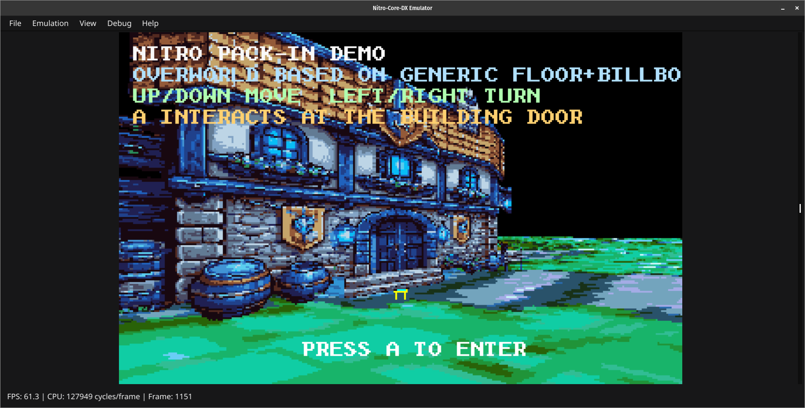
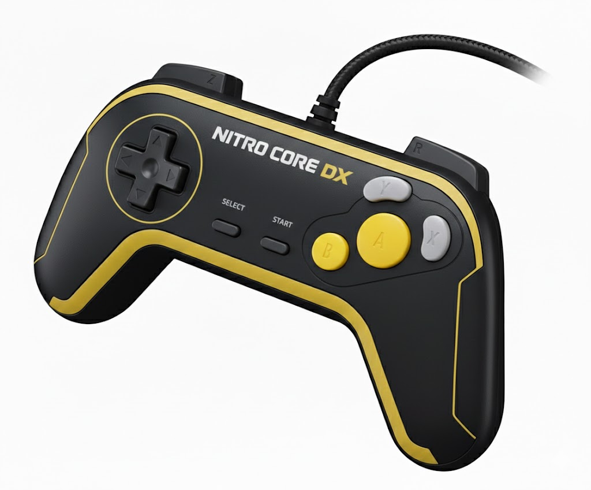

# Nitro-Core-DX

**A 16-bit fantasy console with SNES-style graphics, Genesis-style speed, Yamaha FM sound, CoreLX, and its own Dev Kit.**

Nitro-Core-DX is a custom fantasy console inspired by the best ideas of the 8/16-bit era: layered tile graphics, Mode 7-style perspective tricks, hardware sprites, fast DMA-driven rendering, Yamaha FM synthesis, and tight cartridge-era constraints. It is not just an emulator. The project includes the console model, a compiled high-level language called CoreLX, an integrated development app, asset tools, an assembler, and a pack-in demo used to prove the whole stack.

> **Active Development:** the core console architecture is stable. Current work is focused on completing the CoreLX toolchain and Dev Kit around the NitroPackInDemo pack-in demo.

---

## Meet Nitro-Core-DX

Picture the console ad you wish ran in a 1994 game magazine: big parallax, fast sprites, crunchy FM bass, weird pseudo-3D tricks, and a name that sounds like it should be printed in chrome.

That is the spirit of Nitro-Core-DX. What if you took SNES-style graphics, Genesis-style speed and DMA, Yamaha FM sound, and built a new console around them? Think of it as the machine from an alternate timeline where Nintendo and Sega collaborated instead of competing. I am not trying to recreate history. I am trying to create the console that should have existed.

The project is built from the ground up with modern tooling, but it keeps the good parts of classic console development: a clear hardware model, fast frame-based thinking, direct control over graphics and audio, and a real cartridge workflow.

---

## The Vision: Best of Both Worlds

### What I'm Stealing (Politely) from SNES

The SNES influence is mostly visual:

- **Four background layers** for parallax, HUDs, status panels, and scene composition
- **Matrix Mode** for Mode 7-style perspective and rotation across four independently usable matrix-capable layers
- **RGB555 color** with a 256-color indexed display palette
- **Hardware sprites** with priorities, blending, alpha, and native sizes from 8×8 up to 128×128
- **Banked memory concepts** for a cartridge-oriented programming model

### What I'm Taking from Genesis

The Genesis side is about speed, DMA, and sound. Its faster CPU budget and DMA-heavy feel made arcade-style games move with a snap, and its Yamaha YM2612 gave the console a sharp FM identity. Nitro-Core-DX takes that energy and pairs it with the YM2608/OPNA, a bigger Yamaha FM chip with FM, SSG, rhythm, and ADPCM capabilities.

That gives Nitro its Genesis influence: responsive 16-bit pacing, practical graphics transfers, Yamaha FM character, richer chip resources, and a music pipeline built around compact `.ncdxmusic` streams.

### The Result

A fantasy console with SNES-style visuals, Genesis-style speed, Yamaha FM audio, smooth 60 FPS targets, advanced parallax scrolling, and four Matrix Mode-capable background layers for perspective effects, racing-style scenes, and pseudo-3D landscapes.

---

## What Makes It Different

Nitro-Core-DX is becoming a complete game-making platform, not just a ROM runner.

- **The console/emulator** models the CPU, memory map, PPU, YM2608 audio path, input, ROM loading, and frame stepping.
- **CoreLX** is the compiled high-level language for writing Nitro games without dropping all the way to assembly.
- **The Dev Kit** is the integrated app for editing, building, running, debugging, and authoring assets.
- **Sprite Lab and Tilemap Lab** cover visual asset creation and project insertion.
- **Sound Studio** is the next major tool gap: runtime audio support exists, but the import/preview/export UI is still in progress.
- **Assembler v1** remains available for lower-level workflows.

The important idea is that all of these pieces are meant to meet in the same place: build a project, run it on the emulator, validate it against the hardware model, and eventually package it like a real console game.

---

## Why Go?

Nitro-Core-DX is written in Go because it gives the project compiled native binaries, solid performance for a 60 FPS emulator loop, readable systems code, and straightforward cross-platform builds. Memory safety is a useful bonus, but the real reason is practical: the code needs to be fast enough to run the console well and simple enough to keep improving.

---

## CoreLX

CoreLX is the compiled, Lua-like language for Nitro-Core-DX. It is designed for hardware-first game programming: you can write approachable code while still thinking in frames, sprites, backgrounds, memory, input, and audio.

The language is being stabilized through a real acceptance target rather than toy examples. The ROM-first pack-in demo, NitroPackInDemo, is being rebuilt in CoreLX to prove that the compiler, runtime helpers, asset pipeline, and Dev Kit can support an actual game.

The practical v1 surface is largely in place: modules, structs, arrays, control flow, hardware builtins, image/music assets, project manifests, larger sprite constants, and multi-bank far calls. The current large demo rebuild is exposing a same-function branch-lowering/codegen issue, so the CoreLX version is not yet the accepted runnable showcase.

The CoreLX docs are scheduled for a separate deep-dive alignment pass, so verify edge details against the compiler tests while that work is in progress.

---

## The Dev Kit

The Nitro-Core-DX App is the integrated development environment for the console.

Current user-facing pieces include:

- CoreLX editor
- Build and Build + Run workflow
- Embedded emulator pane
- Sprite Lab for sprite art
- Tilemap Lab for map editing
- Project templates
- ROM loading for direct `.rom` testing

Sound Studio is not complete yet. The runtime side is ready enough to build on: `.ncdxmusic` assets, YM2608 playback, and Dev Kit audio queueing exist. The missing piece is the authoring UI for importing, inspecting, previewing, and exporting music assets.

See [Dev Kit Architecture](docs/DEVKIT_ARCHITECTURE.md) for the backend/frontend split and current tool status.

---

## Current Showcase: NitroPackInDemo

The proving ground for Nitro is **NitroPackInDemo**.

The original ROM-first version is complete enough to serve as the stable showcase: title, pseudo-3D overworld, scene transitions, interior room, NPC dialogue, and credits. It proves the console hardware and rendering ideas before those same ideas are rebuilt through CoreLX.



The CoreLX rebuild is the active acceptance test for the language and toolchain. Its source now covers the same broad slice: matrix-plane floor, app-level facade effect built from transform/rendering primitives, player sprite/HUD, larger-sprite LOD objects, collision/door logic, interior room, dialogue, credits, and reset flow.

The current CoreLX rebuild is exposing a large-program branch-lowering/codegen issue in the compiler. Until that is resolved, the completed ROM-first version remains the runnable showcase.

Build and run the ROM-first showcase:

```bash
go run -tags testrom_tools ./Games/NitroPackInDemo -out roms/nitro_pack_in_demo.rom
./nitro-core-dx -rom roms/nitro_pack_in_demo.rom
```

The active CoreLX rebuild source is `Games/NitroPackInDemo/corelx/overworld.corelx`; that path currently hits the compiler blocker above and is kept as the target workflow being stabilized.

More detail lives in [NitroPackInDemo README](Games/NitroPackInDemo/README.md) and [NitroPackInDemo design](Games/NitroPackInDemo/DESIGN.md).

---

## Console Design

<div align="center">


*Isometric view of the Nitro-Core-DX console*


*Top-down view showing the console design*



*The Nitro-Core-DX controller design*

</div>

---

## System Specifications

| Feature | Specification |
|---------|---------------|
| **Display Resolution** | 320×200 pixels (landscape) / 200×320 (portrait) |
| **Color Depth** | 256 colors (8-bit indexed) |
| **Color Palette** | 256-color CGRAM, RGB555 format, 32,768 possible colors |
| **Background Layers** | 4 independent layers: BG0, BG1, BG2, BG3 |
| **Matrix Mode** | Four matrix-capable background layers with per-layer transforms, HDMA updates, outside-screen handling, and direct color |
| **Sprites** | 128 hardware sprites |
| **Sprite Sizes** | 8×8, 16×16, 32×16, 32×32, 64×32, 64×64, 128×64, 128×128 |
| **Tile Size** | 8×8 or 16×16 pixels, configurable per layer |
| **Audio** | YM2608/OPNA audio subsystem: FM, SSG, rhythm, ADPCM |
| **Audio Sample Rate** | 44,100 Hz |
| **CPU Speed** | ~7.67 MHz, 127,820 cycles per frame at 60 FPS |
| **Memory** | 64KB per bank, 256 banks, 16MB total address space |
| **ROM Size** | Up to 3.9MB, 125 banks × 32KB LoROM windows |
| **Frame Rate** | Target: 60 FPS; current desktop emulator build holds steady 60 FPS in the tested baseline |

For the full hardware contract, see [Complete Hardware Specification v2.1](docs/specifications/COMPLETE_HARDWARE_SPECIFICATION_V2.1.md).

---

## Project Status

### Implemented

- Core CPU, memory, PPU, input, ROM loading, frame stepping, and assembler workflows.
- Four-layer graphics, Matrix Mode, DMA/HDMA, sprites, priorities, blending, and larger sprite sizes.
- YM2608 runtime audio, `.ncdxmusic` stream playback, and CoreLX `music.*` playback.
- Major CoreLX v1 language/runtime surface needed for current demo and tooling work.
- Dev Kit Build/Run, embedded emulator, diagnostics, Sprite Lab, and Tilemap Lab.

### In Progress

- NitroPackInDemo CoreLX acceptance.
- Compiler large-program branch/codegen fix for the current overworld rebuild.
- Dev Kit-generated templates/snippets staying aligned with current CoreLX.
- Sound Studio MVP for `.ncdxmusic` import, inspection, preview, export, and project insertion.
- YM2608 conformance, Tilemap/asset workflow hardening, and editor/debugger UX polish.

### Roadmap

- **v0.2.x current development window:** ROM-first pack-in demo is runnable; CoreLX rebuild and Dev Kit alignment are active.
- **v0.2.5 target:** CoreLX v1 toolchain validated by rebuilding the pack-in demo.
- **v0.3.0 target:** Dev Kit readiness around the finished language, including sprite/tilemap/sound tooling and current manuals.

For the live milestone plan, see [Next Steps Plan](docs/planning/NEXT_STEPS_PLAN.md), [V1 Charter](docs/planning/V1_CHARTER.md), and [V1 Acceptance Criteria](docs/planning/V1_ACCEPTANCE.md).

---

## Quick Start

### Download a Release

Prebuilt packages are published on GitHub:

- [Releases](https://github.com/RetroCodeRamen/Nitro-Core-DX/releases)
- [Latest release](https://github.com/RetroCodeRamen/Nitro-Core-DX/releases/latest)

Package names:

- Linux: `nitrocoredx-<version>-linux-amd64.tar.gz`
- Windows: `nitrocoredx-<version>-windows-amd64.zip`

After extracting:

- Linux: run `./nitrocoredx`
- Windows: run `nitrocoredx.exe`

See [Release Binaries](docs/guides/RELEASE_BINARIES.md) for packaging details.

### Build from Source

Prerequisites:

- Go 1.22 or later
- SDL2 development libraries

Install SDL2:

```bash
# Ubuntu/Debian
sudo apt-get install libsdl2-dev

# Fedora/RHEL
sudo dnf install SDL2-devel

# macOS
brew install sdl2
```

Clone and run the integrated Dev Kit:

```bash
git clone https://github.com/RetroCodeRamen/Nitro-Core-DX.git
cd Nitro-Core-DX
go run ./cmd/corelx_devkit
```

Optional standalone emulator build:

```bash
go build -o nitro-core-dx ./cmd/emulator
./nitro-core-dx -rom path/to/game.rom
```

Do not use `go build ./...` as the default project build; it sweeps vendored reference code under `Resources/` that needs C libraries this project does not depend on. See [Build Instructions](docs/guides/BUILD_INSTRUCTIONS.md) for the longer workflow.

---

## Using the Dev Kit

The normal workflow is:

1. Create a project from a template or open an existing `.corelx`, `.ncdx`, `.cart`, or `.rom`.
2. Edit CoreLX in the integrated editor.
3. Click **Build + Run**.
4. Test the result in the embedded emulator.
5. Use Sprite Lab and Tilemap Lab to create or update visual assets.

Use **Load ROM** when you want to run a prebuilt `.rom` without recompiling. Use **Capture Game Input** when testing controls in the embedded emulator.

---

## Developer Notes

For emulator flags, input mapping, test commands, test ROM generators, and deeper debugging workflows, see [Build Instructions](docs/guides/BUILD_INSTRUCTIONS.md), [test ROM docs](test/roms/README_TEST_ROMS.md), [testing docs](docs/testing/README.md), and [debugging guide](docs/DEBUGGING_GUIDE.md).

---

## Documentation

Start here:

- [Documentation Map](docs/README.md): current vs historical documentation
- [Next Steps Plan](docs/planning/NEXT_STEPS_PLAN.md): current milestone sequence
- [V1 Charter](docs/planning/V1_CHARTER.md) and [V1 Acceptance Criteria](docs/planning/V1_ACCEPTANCE.md): product scope and release gates

Making games:

- [Programming Manual](PROGRAMMING_MANUAL.md): CoreLX and Dev Kit guide
- [CoreLX implementation status](docs/CORELX_V1_IMPLEMENTATION_STATUS.md): language/toolchain handoff
- [CoreLX syntax v1](docs/specifications/CORELX_SYNTAX_V1.md): language syntax charter
- [CoreLX cartridge format](docs/specifications/CORELX_CARTRIDGE_FORMAT.md): `.cxasset`, `.ncdx`, and `.cart`
- [NitroPackInDemo design](Games/NitroPackInDemo/DESIGN.md): pack-in demo design and acceptance role

Understanding the hardware:

- [Complete Hardware Specification v2.1](docs/specifications/COMPLETE_HARDWARE_SPECIFICATION_V2.1.md): current evidence-based hardware spec
- [System Manual](SYSTEM_MANUAL.md): system-level manual under revision
- [Hardware Features Status](docs/HARDWARE_FEATURES_STATUS.md): current hardware feature status
- [YM2608 audio subsystem spec](docs/specifications/APU_FM_OPM_EXTENSION_SPEC.md): audio design and implementation status

Development and testing:

- [Dev Kit Architecture](docs/DEVKIT_ARCHITECTURE.md): frontend/backend boundary and tool status
- [Development Notes](docs/DEVELOPMENT_NOTES.md): process notes and project history
- [Testing docs](docs/testing/README.md): test commands and test guides
- [Build Instructions](docs/guides/BUILD_INSTRUCTIONS.md): source build details
- [Release Binaries](docs/guides/RELEASE_BINARIES.md): release package workflow

Historical and stale material is kept under [docs/archive](docs/archive/) for context. Treat archived files as history, not current status.

---

## Project Structure

```text
Nitro-Core-DX/
├── cmd/                    # User-facing tools: emulator, CoreLX compiler, Dev Kit, importers, assembler
├── internal/               # Emulator, compiler, PPU/APU/CPU, Dev Kit services, debug support
├── Games/                  # First-party game/demo projects, including NitroPackInDemo
├── roms/                   # Active runnable ROM artifacts
├── test/                   # Test ROMs, sample programs, and validation helpers
├── docs/                   # Specs, planning docs, guides, testing docs, archive
├── Images/                 # Console/controller images
└── Resources/              # External/reference resources and visual assets
```

Important root docs include `PROGRAMMING_MANUAL.md`, `SYSTEM_MANUAL.md`, `CHANGELOG.md`, and this README.

---

## Contributing

Contributions are welcome. The best starting point is the current documentation map and roadmap:

1. Read [docs/README.md](docs/README.md).
2. Check [Next Steps Plan](docs/planning/NEXT_STEPS_PLAN.md) and [V1 Risks](docs/planning/V1_RISKS.md).
3. Run the relevant tests before opening a PR.
4. Use `go fmt` for Go changes.
5. Keep README changes high-level; put implementation detail in the appropriate doc.

---

## License

This project is licensed under the MIT License. See [LICENSE](LICENSE) for details.

---

## Acknowledgments

- **SNES**: for showing how much personality layered 16-bit graphics can carry
- **Sega Genesis**: for the speed, DMA-heavy feel, and Yamaha FM sound lineage that helped define 16-bit games
- **The retro game development community**: for keeping old hardware ideas alive and worth remixing
